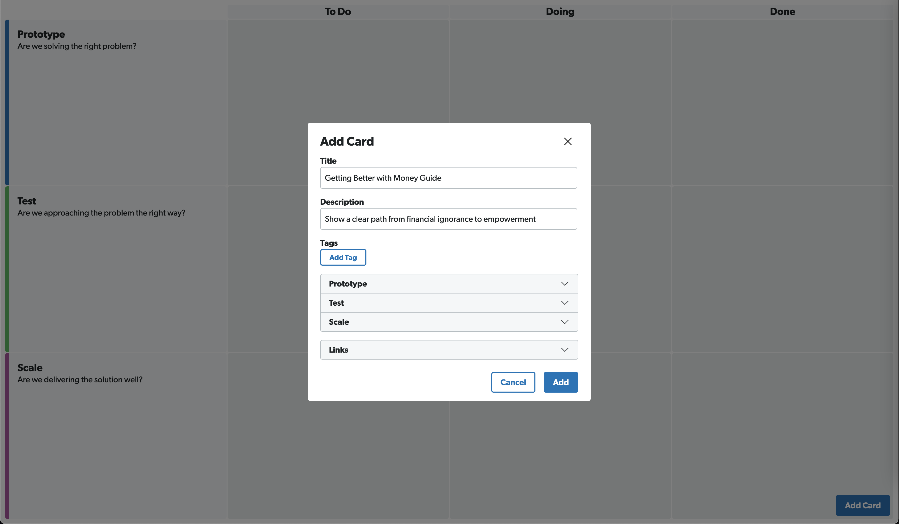
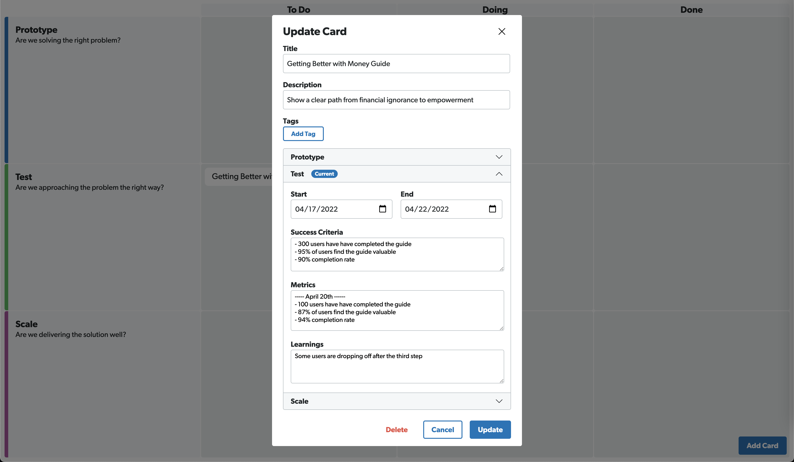
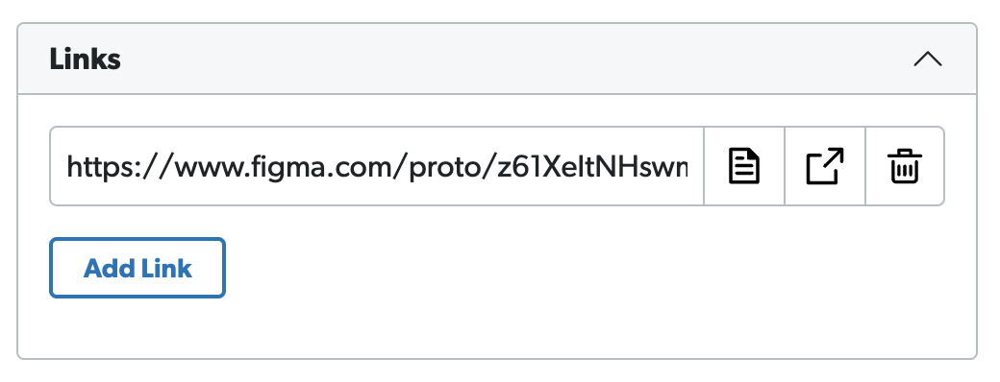

# Ideate

Does your product team struggle with keeping track of long running prototypes and tests?
So have we.
Ideate is a board separate from your ticket/story board that keeps track of prototypes, tests, and scaling them to features if they're successful.
Track progress, learnings, and treat tests as a first class citizen with Ideate!

## Features

### Adding Cards and Tracking Progress

Add a new card every time your team wants to track a new piece of work.
Add notes, learnings, metrics, and other details for each prototype, testing, and scaling phase.

### Updating Cards

As your team progresses through prototypes, tests, and scaling those features, update the card to reflect the new learnings.

### Adding External Links

Have a link to Figma, Notion, or Jira? Add those links directly to the card for your team to view!

## Contributing

Want to help? Reach out to Patrick Brady directly or make a pull request with your changes.
